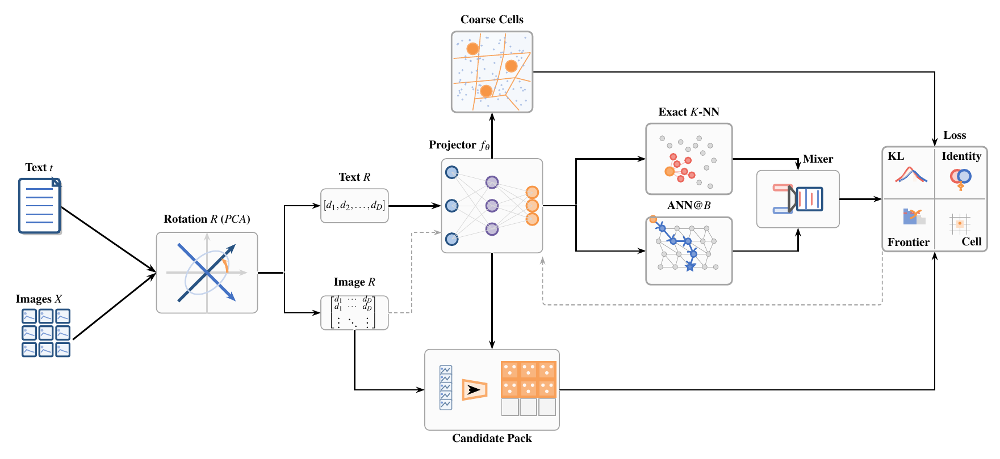
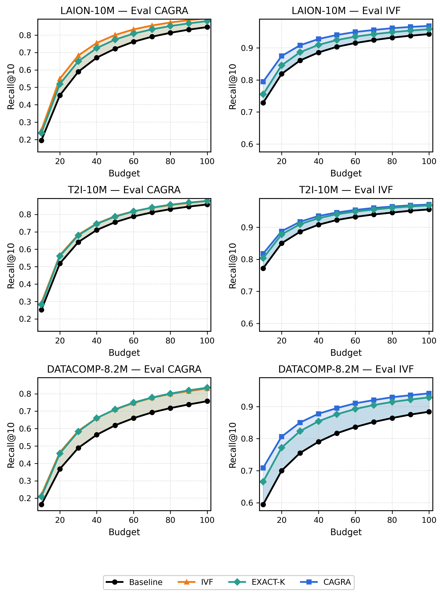
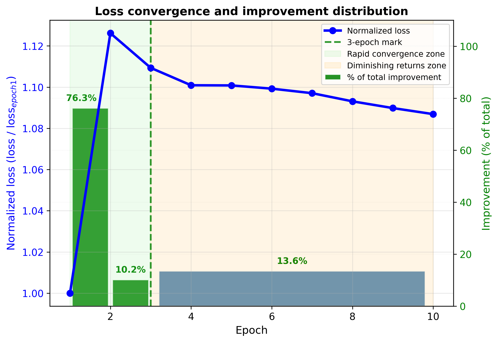

# IAQP: Index-Aware Query Projection for Budgeted Text-to-Image Retrieval

IAQP is a lightweight query-side adaptation method for large-scale text-to-image retrieval over fixed ANN indices. Instead of rebuilding the index or changing the backend, IAQP learns a small residual projector that rewrites text queries so they become more reachable under strict ANN search budgets.

The method is designed for frozen image indices and fixed search policies such as CAGRA and IVF. In the paper setting, IAQP is trained on precomputed CLIP embeddings and improves retrieval quality at the same budget, with no change to the indexed image bank.



Index-aware training loop. Text and image embeddings are PCA-transformed once into `Text R` and `Image R`, and a residual projector produces `q`. Each batch builds a budget-aware candidate pack from `q`, mixes exact and ANN@B teachers, and trains `f_theta` using KL distillation with identity, frontier-gap, and coarse-cell regularizers.

## Method Overview

IAQP follows the same structure as the paper methodology:

- PCA-based alignment maps images and text queries into the image-defined index space.
- A lightweight residual query projector learns a small correction on top of the aligned text embedding.
- A coarse-cell routing head adds region-level supervision that matches backend routing behavior.
- Budget-aware candidate packs restrict training to candidates that are realistic under a fixed ANN budget.
- A mixed teacher combines ANN-at-budget rankings with exact neighbors.
- Training uses list-wise KL distillation together with identity, frontier-gap, and coarse-cell regularization.

This makes IAQP a query-side adapter for a fixed index rather than an index redesign.

## Main Idea

At tight budgets, many retrieval failures happen before the ANN backend has enough traversal budget to reach the right neighborhood. IAQP addresses this by moving the query, not the index.

- The image bank stays fixed.
- The ANN backend stays fixed.
- Only the text query is adapted at inference time.

This is especially useful when rebuilding a production index is expensive or operationally undesirable.

## Repository Layout

```text
IAQP/
  core/                 Main training and evaluation entry points
  config/               Experiment configuration
  dataset_loader/       Dataset loading utilities
  encode_data/          Cache and preprocessing helpers
  scripts/              Evaluation and analysis runners
  notebooks/            Canonical reproduction notebooks
  docs/img/             README figures
```

## Reproducing the Paper

Use the notebooks in [`notebooks/`](/home/hamed/projects/IAQP/notebooks) as the canonical entry point:

1. [`01_training_checkpoints.ipynb`](/home/hamed/projects/IAQP/notebooks/01_training_checkpoints.ipynb)
   Train the checkpoints used in the paper.
2. [`02_evaluation_and_generalization.ipynb`](/home/hamed/projects/IAQP/notebooks/02_evaluation_and_generalization.ipynb)
   Run in-domain evaluation, cross-backend transfer, cross-dataset transfer, and Wasserstein analysis.
3. [`03_qps_and_result_audit.ipynb`](/home/hamed/projects/IAQP/notebooks/03_qps_and_result_audit.ipynb)
   Run QPS experiments and audit the generated outputs.

Generated artifacts are expected under `notebooks/outputs/`, which is intentionally ignored by git.

## Minimal Run Flow

The clean reproduction path is:

1. Prepare precomputed embedding caches for LAION-10M, T2I-10M, and DataComp-8.2M.
2. Train 3-epoch checkpoints with [`core/main.py`](/home/hamed/projects/IAQP/core/main.py).
3. Run the evaluation suite with [`notebooks/regenerate_all_results.py`](/home/hamed/projects/IAQP/notebooks/regenerate_all_results.py).
4. Run the throughput suite with [`notebooks/regenerate_qps_results.py`](/home/hamed/projects/IAQP/notebooks/regenerate_qps_results.py).

Example commands:

```bash
python notebooks/regenerate_all_results.py
python notebooks/regenerate_qps_results.py
```

For a single experiment:

```bash
CUDA_VISIBLE_DEVICES=0 python scripts/ckpt_shootout_comprehensive.py \
  --dataset laion \
  --size 10m \
  --train_backend cagra \
  --full_dataset \
  --at_k 10,50,100
```

## Figures

Cross-backend generalization from the paper:



Few-epoch convergence behavior used to justify the 3-epoch training schedule:



## Brief Summary of Results

Across LAION-10M, T2I-10M, and DataComp-8.2M, IAQP consistently improves Recall@10 under fixed ANN budgets on both CAGRA and IVF backends. The gains are strongest in the low-budget regime, where traversal is most constrained, and the method also transfers across backends and across datasets under shared PCA.

## Notes

- This repository keeps only the code and the canonical reproduction notebooks.
- Large datasets, checkpoints, paper build artifacts, and generated outputs are intentionally excluded from git.
- Some paper-source assets live under `latex_results/`, but that directory is not part of the tracked reproduction surface.
